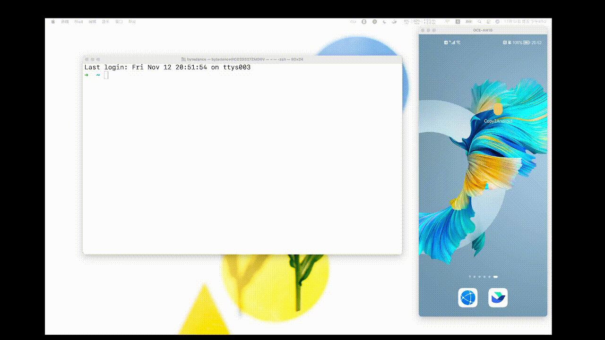

# 1. Introduce

**This project,support you copy from Mac,and paste it on Android.**  The data only support LAN,not
over cross Internet.

Not support for iphone,because this feature implemented by Apple,Inc.


# 2. How to use?
## 2.1. Server Settings
You need Python3 Environment,and

`pip3 install copy2android`

Then Run Python Script:
```
from copy2android import M2A as M

M.start()
```
ps:M2A means Mac To Android.


 You will See QR Code On your Screen

## 2.2 App Settings
- [download app](https://raw.githubusercontent.com/loyal888/copy2android/master/android/app-release.apk)

## 2.3 Install App and Scan QRCode
Have Fun.

# How it works?

- Firstly,we need monitor the `command + c`,and get the content.

  - how to monitor?
    - using python script and get the clipboard content.
- And when we get the clipboard content,we send the content to your android devices.

  - how to send?
    - By using **WebSocket**.To achieve communicating between Mac and Android devices, we need a
      web-socket server,when we get the clipboard content,we sent it to android device.
- When we got the content from server, we write it to android clipboard
- Now,we can paste on Android devices!

# Future Plan

- copy from android,paste on Mac.

